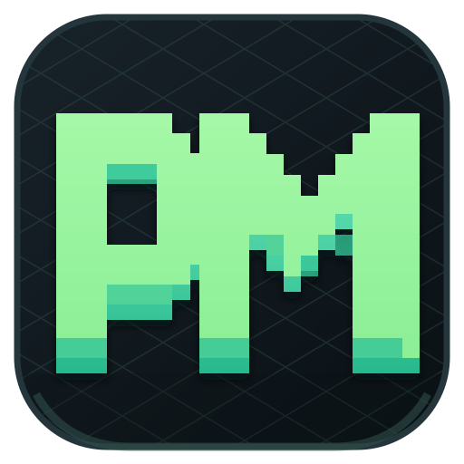

<p align="center">
  
</p>

<h1 align="center">PhysMap</h1>

<p align="center"><b>A free desktop projection-mapping workspace for macOS, Windows, and Linux.</b></p>

<p align="center">Map light onto anything. Draw a shape over a real object, drag the corners to fit, and project &mdash; with images, video, YouTube, animated surfaces and 2D physics, all in one focused window.</p>

<p align="center">
  <a href="https://github.com/mirauta-alexandru/PhysMap/releases"><b>Download for macOS / Windows / Linux &rarr;</b></a>
</p>

---

## Why PhysMap

PhysMap is the easiest way to start with projection mapping. No expensive software,
no account, no cloud. It is a native desktop app that runs fully offline and is built
around one idea: **lining projected light up with a real object should be the whole
workflow, not an afterthought.**

The app opens a dedicated, fully black fullscreen window on your projector (a second
display), while the editor stays on your laptop. You keep modeling shapes on the
editor and the projector mirrors a clean output &mdash; no grid, no toolbar, no
handles &mdash; so you can align everything live on the wall.

---

## What is projection mapping?

Projection mapping turns any real-world surface &mdash; a wall, a box, a building
facade, a sculpture &mdash; into a display. Instead of a flat rectangle, you shape the
projected light to match the physical object so graphics, video, or animation appear
to live *on* it.

---

## Download &amp; install

Grab the latest build from the [**Releases**](https://github.com/mirauta-alexandru/PhysMap/releases) page:

| Platform | File |
| --- | --- |
| **macOS** (Apple Silicon &amp; Intel) | `.dmg` |
| **Windows** (x64) | `.exe` installer |
| **Linux** (x64) | `.AppImage` or `.deb` |

> These are alpha builds. The macOS package is ad-hoc signed and the Windows one is
> unsigned, so on first launch you may need to **Control-click &rarr; Open** (macOS)
> or **More info &rarr; Run anyway** (Windows). Apple notarization and Windows code
> signing come later.

---

## Features

- **Dedicated projector output** &mdash; a separate, pure-black fullscreen window on
  the display you choose. The editor keeps running so you align live; unplug the
  projector and the output stops cleanly.
- **Live output safety** &mdash; freeze the last clean frame while you edit, or send
  an instant blackout without closing the projector window.
- **Scene Layers** &mdash; name, select, hide, lock and duplicate mapped surfaces,
  emitters, force fields, gates and portals from one organized scene view.
- **Quick-start templates** &mdash; begin with a blank stage, animated facade,
  physics lab or portal flow instead of wiring every scene from zero.
- **Command palette** &mdash; press `Cmd/Ctrl + K` to search tools, scene actions,
  output controls and project commands.
- **Corner-pin mapping** &mdash; draw a square, triangle, or freeform line, then drag
  the points onto your object. 4-corner shapes get a true perspective warp.
- **Put anything inside a shape:**
  - Solid / glow / pulse / rainbow fills
  - Animated LED outlines (static, snake, chase, sparks) with adjustable speed
  - Built-in animations: 3D cube / grid / orb, neon tunnel, starfield, helix, scan,
    equalizer, wave, radar, rings, kaleido, aurora and constellation
  - An **imported image**, a **local video file** (loops, muted), or a **YouTube
    video** &mdash; all perspective-warped onto the shape
- **Cut (mask)** &mdash; punch a black hole over part of the projection to hide light
  spill or carve content to an exact shape.
- **Curved lines** &mdash; with the Line tool, hover any segment and drag to bend it
  into a smooth curve, with a live preview. Close the path to form a shape.
- **Reactive physics** &mdash; emit configurable orb, cube or shard bursts with
  adjustable rate, power, count and spread. Add gravity, repulsion, vortices,
  portals, color gates and boost gates; gates can target one particle type.
- **Project hub** &mdash; animated startup, autosaved current project, and a library
  of named projects you can reopen any time.
- **Undo / Redo** with a deep history, and **Export / Import** scenes as `.json`.
- **Retro pixel-art interface** and **fully offline** &mdash; fonts and assets are
  bundled, no internet required.

---

## How to use it

1. **Pick your projector** &mdash; open **OUTPUT**, choose the display, and start the
   fullscreen output. The editor stays on your main screen.
2. **Draw a shape** over the real object &mdash; `Q` square, `T` triangle, `Y` line.
   (For a line, click point by point and double-click to finish; click back on the
   first point to close it into a shape.)
3. **Fit it** &mdash; switch to Select (`V`) and drag the corner points until the
   shape sits exactly on the object. With a line, drag any segment to curve it.
4. **Set its look** &mdash; in the inspector pick a fill (solid, glow, image, video,
   YouTube, animation, cut mask...) and a color.
5. **Align and play** &mdash; everything you do mirrors to the projector output in
   real time.

---

## Keyboard shortcuts

| Key | Action |
| --- | --- |
| `V` | Select / move shapes, drag points |
| `Q` | Square / rectangle |
| `T` | Triangle |
| `Y` | Line (drag a segment to curve it) |
| `X` | Particle emitter |
| `1` / `2` / `3` | Place an orb / cube / shard |
| `G` / `H` / `J` | Gravity / repulsor / vortex |
| `K` / `L` / `O` | Color gate / boost gate / portal pair |
| `Delete` | Delete the selected object |
| `Cmd/Ctrl + D` | Duplicate the selected object |
| `Cmd/Ctrl + K` | Open the command palette |
| `Ctrl/Cmd + Z` | Undo |
| `Shift + Ctrl/Cmd + Z` | Redo |
| `Space` | Pause / resume physics |
| `C` | Clear particles |
| `R` | Reset scene |

---

## Build from source

You need [Node.js](https://nodejs.org) (v18+).

```bash
git clone https://github.com/mirauta-alexandru/PhysMap.git
cd PhysMap
npm install

npm run desktop      # run the desktop app locally (Electron)
npm run dev          # or run the editor in a browser for development
```

### Package native installers

```bash
npm run dist:mac     # macOS DMG (Apple Silicon + Intel)
npm run dist:win     # Windows x64 installer
npm run dist:linux   # Linux x64 AppImage + deb
```

Output is written to `release/`. Pushing a `vX.Y.Z` tag triggers the **Desktop
Release** GitHub Actions workflow, which builds all platforms and publishes a
GitHub Release with the installers attached.

---

## Tech

PhysMap is a small vanilla-JavaScript app wrapped in [Electron](https://www.electronjs.org/),
built with [Vite](https://vitejs.dev) and [Matter.js](https://brm.io/matter-js/) for
the 2D physics. The perspective warping runs on a plain 2D canvas (no WebGL, no heavy
dependencies), so it stays light and runs almost anywhere.

---

## License

MIT &mdash; see [LICENSE](LICENSE). Free to use, modify, and share.
